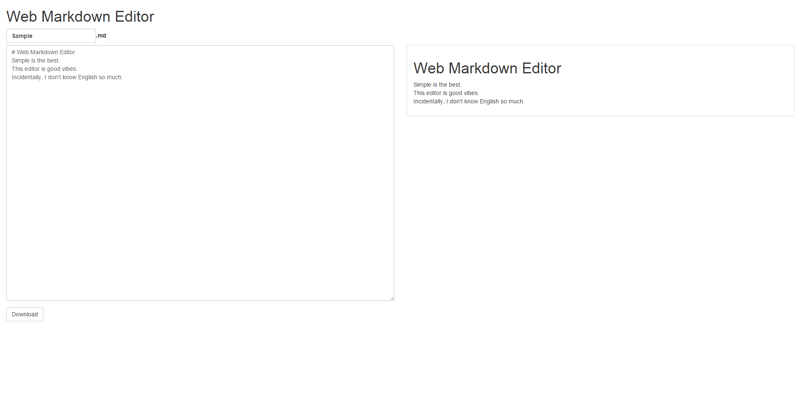

# Web Markdown Editor
Simple is the best.  
This editor is good vibes.  
Incidentally, I don't know English so much.

#### Used  libraries
* [jQuery](https://github.com/jquery/jquery)
* [Bootstrap](https://github.com/twbs/bootstrap)
* [Marked.js](https://github.com/chjj/marked)
* [Hilight.js](https://github.com/isagalaev/highlight.js)
* [Autosizze.js](https://github.com/jackmoore/autosize)

# Usage
* Open the file in the drop to window.  
* Save file by pressing the "Download" button.

  

[Demo Page](http://tnmtmst.github.io/wmde/)

# License
Released under the [MIT license](http://opensource.org/licenses/mit-license.php)